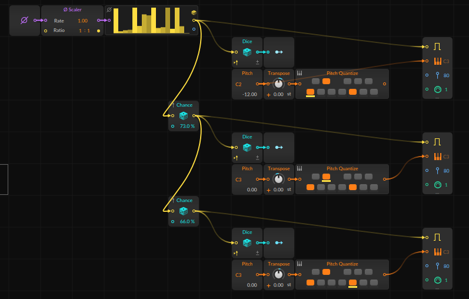
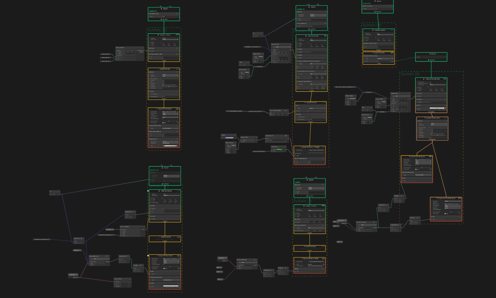
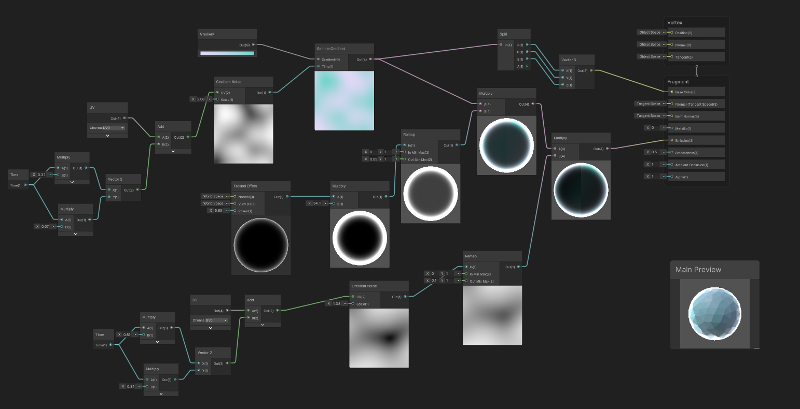

# Generative VFX Bitwig Sandbox

https://user-images.githubusercontent.com/11372210/162390908-99c57137-0c76-4c97-8544-5bb888035745.mp4

## About

Bitwig Studio を用いて作成したジェネラティブな音楽と、
Unity によって作成したジェネラティブな映像を組み合わせてミュージックビデオを作成する遊び。
[Keijiro さんのこちらの作品](https://www.youtube.com/watch?v=8JcLSWA5VGc)にかなり影響されています。

ジェネラティブとは数理モデルやアルゴリズムによるパターンから生成されることを示しています。
タイムラインやシーケンス上にコンテンツを配置していく従来の方法とは異なり、
一定の確率によって表現が変化していき、いつどのような演出が生成されるのかはコンピュータの乱数によって決定されます。

本プロジェクトで使用している音楽や VFX もジェネラティブな仕組みを用いて作られており、
特に VFX は音楽のスペクトラムによっても挙動が変化します。
Bitwig の Note Grid によってある確率で信号を生成し、信号を受け取って乱数生成器が
ピッチを生成するノードを組んでいます。
また映像では Unity の VFX Graph によってパーティクルの挙動を定義し、
一部のパーティクルにはMeshに対応するシェーダをShader Graphで作成して表現しています。

## Tested Environment

- Windows 10 Home
- Unity 2021.2.18
- High Definition Render Pipeline(HDRP)
- Bitwig Studio 4.2

## Install & Usage

今回オーディオファイルが大きかったのでignoreしています。
`Bitwig\generative.bwproject`をBitwig Studioで開いてオーディオファイルを書き出し、`Assets\GenerativeVFXBitwig\Audio\generative-long.wav`として保存してください。

次に`Assets\GenerativeVFXBitwig\Scenes\main.unity`を開き、シーンを再生します。

## Contact

何かございましたら[にー兄さんの Twitter](https://twiitter.com/ninisan_drumarh)
までご連絡ください。
